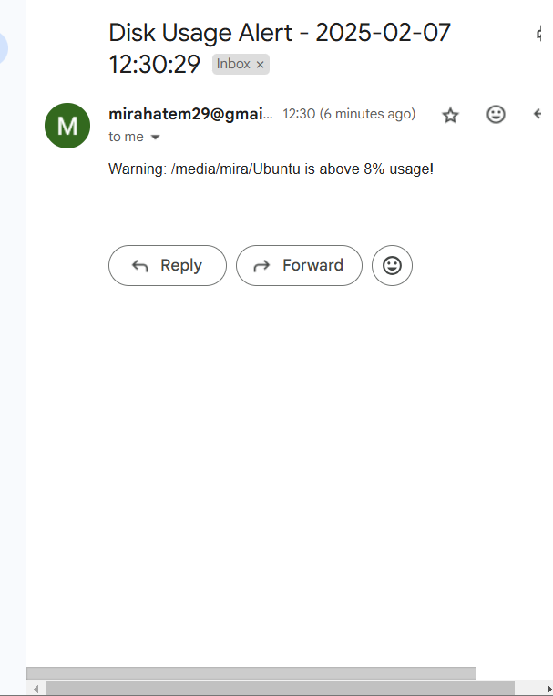
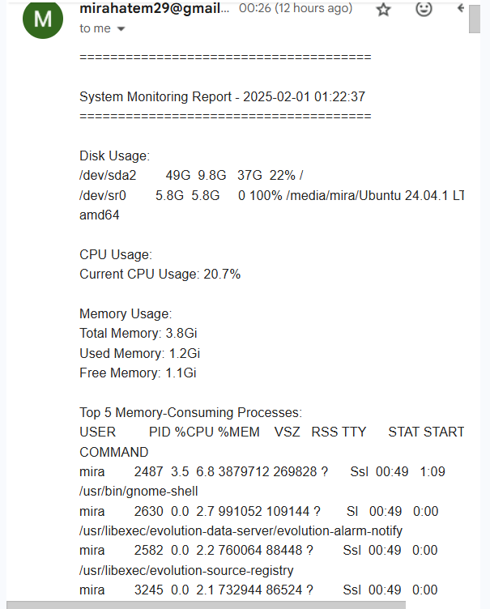

<<<<<<< HEAD
# System Monitoring Script

This script monitors system resources such as disk usage, CPU usage, memory usage, and top memory-consuming processes. It generates a report and sends email alerts if any thresholds are breached.

---

## Table of Contents
1. [Features](#features)
2. [Requirements](#requirements)
3. [Installation](#installation)
4. [Usage](#usage)
5. [Cron Job Setup](#cron-job-setup)
6. [Output Example](#output-example)
7. [License](#license)
8. [Contact](#contact)

---

## Features

- **Disk Usage**: Reports the percentage of disk space used for each mounted partition and warns if usage exceeds a specified threshold.
- **CPU Usage**: Displays the current CPU usage as a percentage.
- **Memory Usage**: Shows total, used, and free memory.
- **Top Memory-Consuming Processes**: Displays the top 5 memory-consuming processes.
- **Report Generation**: Saves collected information into a log file (`system_monitor.log`).
- **Email Alerts**: Sends an email alert if any disk usage exceeds the threshold.

---

## Requirements

- Ubuntu Linux (or similar Debian-based systems).
- Bash shell.
- `mailutils` or `sendmail` for email functionality.
- Optional: Configure SSMTP or Postfix for Gmail SMTP relay.

---

## Installation

1. Clone the repository:
   ```bash
   git clone https://github.com/your-username/system-monitor.git
   cd system-monitor
   ```

2. Make the script executable:
   ```bash
   chmod +x system_monitor.sh
   ```

3. Install required tools:
   ```bash
   sudo apt update
   sudo apt-get install msmtp

---

## Usage

Run the script with optional arguments:
```bash
./system_monitor.sh [-t threshold] [-f log_file]
```

- `-t`: Specify the disk usage warning threshold (default: 10%).
- `-f`: Set the output log file name (default: `system_monitor.log`).

Example:
```bash
./system_monitor.sh -t 15 -f custom_log.log
```
Certainly! Below is a detailed section you can add to your `README.md` file to document the msmtp configuration. This will help others (or yourself in the future) understand how to set up and use msmtp for sending emails via SSH.

### **Example msmtp Configuration Section for README.md**

```markdown
## msmtp Configuration

### Overview
msmtp is a lightweight SMTP client that can be used to send emails from the command line. It's particularly useful for automating email notifications in scripts or applications.

### Installation
To install msmtp, use your package manager. For Ubuntu/Debian-based systems:
```bash
sudo apt update
sudo apt install msmtp
```

### Configuration
#### Step 1: Create the Configuration File
Create a configuration file for msmtp at `~/.msmtprc`. Make sure this file has the correct permissions to prevent unauthorized access:
```bash
touch ~/.msmtprc
chmod 600 ~/.msmtprc
```

#### Step 2: Edit the Configuration File
Open the `~/.msmtprc` file in a text editor:
```bash
nano ~/.msmtprc
```

Add the following configuration details. Replace the placeholders with your actual email address and password:

```plaintext
# Default account settings
defaults
tls on
tls_starttls on
tls_trust_file /etc/ssl/certs/ca-certificates.crt

# Account for Gmail
account default
host smtp.gmail.com
port 587
from your_email@gmail.com
auth on
user your_email@gmail.com
password your_password_or_app_password
```

**Note**: If you're using Gmail, make sure to generate an app-specific password if you have two-factor authentication enabled.

#### Step 3: Test the Configuration
Test the msmtp configuration by sending a test email:
```bash
echo "This is a test email sent using msmtp." | msmtp -a default recipient@example.com
```

Replace `recipient@example.com` with the email address where you want to receive the test email.

### Usage in Scripts
You can use msmtp in your scripts to send emails. Here's an example of how to send an email alert:

```bash
#!/bin/bash

# Email configuration
RECIPIENT="your_email@example.com"
SUBJECT="System Monitoring Alert - $(date '+%Y-%m-%d %H:%M:%S')"
BODY=$(cat <<EOF
System Monitoring Report - $(date '+%Y-%m-%d %H:%M:%S')
======================================

$(cat /path/to/system_monitor.log)

Warning: Disk usage exceeds the specified threshold!
EOF
)

# Send the email using msmtp
if echo "$BODY" | msmtp -a default "$RECIPIENT"; then
    echo "Email alert sent successfully."
else
    echo "Failed to send email alert."
fi
```

Make sure to replace `/path/to/system_monitor.log` with the actual path to your log file.


## Cron Job Setup

To run the script every hour, add a cron job:

1. Open the crontab editor:
   ```bash
   crontab -e
   ```

2. Add the following line to execute the script hourly:
   ```bash
   0 * * * * /path/to/system_monitor.sh > /dev/null 2>&1
   ```

---

## Output Example

### Log File (`system_monitor.log`):
```
2024-11-28 14:00:00 - Disk Usage:
Filesystem Size Used Avail Use% Mounted on
/dev/sda1 50G 45G 5G 90% /
Warning: /dev/sda1 is above 10% usage!
2024-11-28 14:00:00 - CPU Usage:
Current CPU Usage: 85.5%
2024-11-28 14:00:00 - Memory Usage:
Total Memory: 16GB
Used Memory: 12GB
Free Memory: 4GB
2024-11-28 14:00:00 - Top 5 Memory-Consuming Processes:
PID USER %MEM COMMAND
1234 root 10.5 python3
2345 user1 8.3 chrome
3456 user2 7.8 java
```

### Email Alert:
Subject: System Monitoring Alert - 2024-11-28 14:00:00  
Body:
```
System Monitoring Report - 2024-11-28 14:00:00
======================================
Disk Usage:
Filesystem Size Used Avail Use% Mounted on
/dev/sda1 50G 45G 5G 90% /
Warning: /dev/sda1 is above 10% usage!

CPU Usage:
Current CPU Usage: 85.5%

Memory Usage:
Total Memory: 16GB
Used Memory: 12GB
Free Memory: 4GB

Top 5 Memory-Consuming Processes:
PID USER %MEM COMMAND
1234 root 10.5 python3
2345 user1 8.3 chrome
3456 user2 7.8 java
```
## 🖼️ Screenshots

| e-mail 1  | e-mail 2  |
|-------------------------------- | --------------------------------- |
|| |

---


=======
# -monitoring-script
A system monitoring script for Ubuntu.
>>>>>>> origin/main
